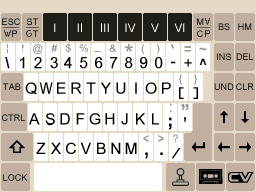
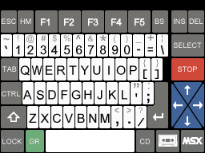
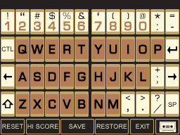

# ColecoDS
ColecoDS - A Colecovision and ADAM Emulator for the DS/DSi

_**Your Vision Is Our Vision...  COLECOVISION**_

To run requires a coleco.rom BIOS to 
be in the same directory as the emulator
or else in /roms/bios or /data/bios

Because the chips used in the Colecovision Hardware were so common in that era, other systems tended
to be very close to the CV in terms of hardware. Often only the IO/Memory was different. As such,
ColecoDS also allows cartridge and sometimes tape/disk games from "cousin" systems to be played - namely 
the Sord M5, the Memotech MTX, the SG-1000/3000, the Spectravision 3x8 SVI, Casio PV-2000, Hanimex 
Pencil II, CreatiVision, the Tatung Einstein and the venerable MSX1.

Features :
-----------------------
* Colecovision game support (.rom or .col files). Requires coleco.rom BIOS.
* Super Game Module support including AY sound chip.
* Megacart Bankswitching support (up to 1024K).
* Coleco ADAM game support (.ddp or .dsk files). Requires eos.rom and writer.rom
* Sega SG-1000 game support (.sg roms)
* Sega SC-3000 game support (.sc roms)
* Sord M5 game support (.m5 roms) - requires sordm5.rom BIOS
* MSX1 game support (.msx or .rom or .cas or .dsk) up to 1024K including SCC emulation
* Spectravideo SVI support (.cas or .rom) - requires svi.rom BIOS
* Casio PV-2000 support (.pv roms) - requires pv2000.rom BIOS
* Hanimex Pencil II support (.pen roms) - requires pencil2.rom BIOS
* Tatung Einstein support (.dsk files or .com run-time files) - requires einstein.rom BIOS
* Memotech MTX game support (.mtx or .run or .com files) - single loader games only.
* Creativision game support (.cv) - requires bioscv.rom BIOS - supports ROMs up to 32K.
* Full Controller button mapping and touch-screen input.
* High-Score support - 10 scores per game.
* Save/Load Game State (one slot).
* Video Blend Mode (see below) and Vertical Sync.
* LCD Screen Swap (press and hold L+R+X during gameplay).
* Overlay support for the few games that need them.
* Super Action Controller, Spinner and Roller Controller (Trackball) mapping.
* Full speed, full sound and full frame-rate even on older hardware.

Copyright :
-----------------------
ColecoDS Phoenix-Edition is Copyright (c) 2021-2024 Dave Bernazzani (wavemotion-dave)

As long as there is no commercial use (i.e. no profit is made),
copying and distribution of this emulator, it's source code
and associated readme files, with or without modification, 
are permitted in any medium without royalty provided this 
copyright notice is used and wavemotion-dave (Phoenix-Edition),
Alekmaul (original port) and Marat Fayzullin (ColEM core) are 
thanked profusely.

The sound drivers (sn76496, ay38910 and Konami SCC) are libraries
from FluBBa (Fredrik Ahlström) and those copyrights remain his.

In addition, since the Z80 CPU and TMS9918 are borrowed from 
ColEM, please contact Marat (https://fms.komkon.org/ColEm/)
to make sure he's okay with what you're doing with the emulator
core.

The ColecoDS emulator is offered as-is, without any warranty.

Credits :
-----------------------
Thanks to Alekmaul who provided the 
baseline code to work with and to lobo
for the menu graphical design.

Thanks to Flubba for the SN76496, AY38910 and SCC sound cores. 
You can seek out his latest and greatest at https://github.com/FluBBaOfWard

Thanks to the C-BIOS team for the open 
source MSX BIOS (see cbios.txt)

Thanks to Andy and his amazing Memotech 
Emulator MEMO which helped me get some
preliminary and simple MTX-500 support 
included.

Thanks to Darryl Hirschler for the keyboard graphics 
for the CreatiVision keypad, the ADAM keyboard,
the MSX keyboard and the MTX keyboard.

Thanks to Marcel de Kogel who wrote the Adam-EM 
emulator which is a bit of a grandfather to the
more modern emulators. I got the final bugs worked 
out of the VDP emulation and for disk drive
block caching on the ADAM thanks to his amazing work.

Special thanks to  Marat Fayzullin, as the 
author of ColEM which is the code for the 
core emulation (specifically TMS9918 VDP
and the CZ80 CPU core).  I think the original 
port was circa ColEM 2.1 with some fixes and 
updated Sprite/Line handling from ColEM 5.6. 
Without Marat - this emulator simply wouldn't exist.

Known Issues and Limitations:
-----------------------
* No more than 1500 files per directory - split ROM files up as needed.
* Path and filename to a ROM can't be longer than 160 characters. Keep them on the shorter side.
* Games that utilize voice samples (Squish Em Sam, Wizard of Wor, etc) will not play the speech due to sound emulation limitations.
* The original 2011 release of StarForce will crash - this is a known bug. There is a patched version of the game StarForce on Atariage.
* MSX envelope, Einstein and Sord M5 CTC sound and noise emulation is not perfectly accurate (but close enough).

BIOS Files :
-----------------------
Here are the BIOS file CRC32 hashes I'm using with all of my testing - seek these out if you want maximum compatibility:
```
* 3aa93ef3	coleco.rom (original version - rev 7)
* a30b0c34	coleco.rom (faster boot)
* 94ee12f3	msx.rom (MSX) - see below for more options
* c3c590c6	bioscv.rom (Creativision)
* a746eeb6	einstein.rom (Tatung Einstein)
* 338d7b59	pencil2.rom (Hanimex Pencil II)
* 8f31f297	pv2000.rom (Casio PV-2000)
* 92cf9353	sordm5.rom (Sord M5)
* bc433df6	svi.rom (Spectravision)
* 05a37a34	eos.rom (ADAM - rev 5/6)
* 58d86a2a	writer.rom (ADAM - rev 80)
```

For the MSX, we support a number of different (optional) BIOS ROMs. To be honest, after quite a bit of searching online, I'm not quite sure what machine the ubiquitous msx.rom represents - it's some generic European machine and from doing binary compares, it appears to be extremely similar to the Goldstar FC-200 or possibly the Casio MX-15 (11 bytes different in each). 

As such, starting with version 8.2, ColecoDS will support additional optional MSX BIOS roms as follows (and you can select them in Configuration and set a global default if you like):

```
* e9ccd789  cx5m.rom    - Yamaha's UK/EU Machine with 32K of RAM
* 5486b711  hx-10.rom   - Toshiba's UK/EU Machine with 64K of RAM
* ee229390  hb-10.rom   - Sony HitBit JP Machine with 16K of RAM (uses the Japanese matrix)
* 5ad03407  fs-1300.rom - National JP Machine with 64K of RAM (uses the Japanese matrix)
* ee229390  pv-7.rom    - Casio PV-7 with just 8K of RAM! If you can't find this BIOS, use pv-16.rom or hb-10.rom

And for the MSX.ROM you can substitute one of these standard machines (and they will be searched/found in this order):
* 15e503de  cf-2700.rom - Panasonic CF-2700 UK Machine with 64K of RAM in slot 3 (normally slot 1)
* 8205795e  fc-200.rom  - Goldstar FC-200 European Machine with 64K of RAM in slot 3 (normally slot 2)
```

Name the BIOS ROMs above exactly as shown (if you find them online, they will have longer names which will also generally work) - place them into your usual BIOS directory. Once you select one of these optional BIOS roms (in Configuration), you will also enable that specific MSX machine to be emulated. This means RAM and memory slots will be exactly the same as the machine you're trying to emulate. See the MSX section for details on this.

ADAM Compatibility :
-----------------------
* The emulated ADAM will run most tape images (.ddp) or disk images (.dsk) - just pick the .dpp or .dsk image and it should auto boot (make sure you have all the ADAM BIOS files needed!)
* Three drive bays are emulated - two Disk drives at either 160K (SSDD) or 320K (DSDD) and a Tape drive at the standard digital data pack size of 256K. This should be enough for any program you want to run.
* The emulated ADAM is a 128K system (64K internal memory and 64K expanded RAM) - enough for almost any game or program. For the DSi and above with extra memory, this expanded ADAM ram is boosted to 2MB (32 banks of 64K each).
* By default, RAM is cleared when you reset the ADAM - you can change this to a random pattern on a per-game basis if you want.
* The 32K ROM expansion of the Adam is emulated - rename your expansion rom as ".adm" so that the emulator knows it's a special ROM designed to be in the expansion ROM area. You can also rename normal cart .rom files as .adm to load them up with proper Adam emulation (useful if you want to run some of the Adam carts like in-house diagnostics utilities in full Adam emlation mode... normally when you load a .rom it would just load up with standard Colecovision emulation).
* You can turn on the full ADAM keyboard with the Configuration of Overlays (choose 'ADAM KEYBOARD'). You can also use the keyboard/joystick icons to toggle between the keyboard and the joypad.
* The tape or disk images do NOT automatically write back to your SD card... you have to hit the little Cassette icon to make that happen (and only when the tape/disk is idle - it won't save if the tape/disk is busy reading/writing).
* Due to screen constraints, the WILDCARD key is omited but you can use it if you hit SHIFT ST/GET or you can map the WILDCARD key to one of the DS buttons.

MSX Compatibility :
-----------------------
Considering this is a Colecovision emulator, the MSX1 support and compatibility is reasonably high.  In Game Options you will notice that the default MSX Mapper is set to "GUESS" which does a fairly good job loading the ROM - especially for 32K or smaller games. However, if a game doesn't run, you can try these suggestions:
* A small number of games don't work with the open-source C-BIOS. In this case you would need a real msx.rom BIOS. You can set this up in Game Options. If you have an MSX.ROM bios, it will use it by default.
* Most 64K games use the ASC16 memory mapper - so you can try that one... but a few (e.g. Mutants from the Deep) are linear mapped from 0-64K and you will need to pick LINEAR64 in Game Options. 
* The auto-detection on KONAMI8, KONAMI-SCC and ASCII8/16 mappers is pretty good... but some games don't detect well - you should try various mappers if the "larger than 64K" game won't run.
* SCC is emulated for the games that use that advanced Konami sound chip. If your game is < 64K rom size, it may not auto-detect Konami SCC as the mapper type - but you can override this in the config.
* Occasionally one ROM won't run but an alternate dump might. For example, the 384K version of R-Type is a bit of a mess for the emulator to handle, but someone made a clean 512K version that loads and runs great.
* With a little diligence in trying different mapping/BIOS combinations, you should be able to achieve a 97% run rate on MSX1 games. 
* MSX2 games are not supported and will not run - the VDP alone is different enough. Try MSXDS for a full-featured DS/DSi emulator for the full range of MSX computers.

MSX is not a single machine but a standard - there are lots of machines and lots of BIOS files. The one I did most of my testing is MSX.ROM with a CRC32 of 94ee12f3 - this is the one used by many other MSX emulators. ColecoDS also supports a number of other specific machines - see the BIOS section above for details on those roms.

MSX1 cassettes are supported in .CAS format. You can use the START and SELECT buttons for the common bload or run commands (or use the Cassette menu for more choices).

MSX1 disks are supported in .DSK format. The files must be raw sector dumps and the file must be exactly 360K (SS) or 720K (DS) in size to detect properly (very typical of the .dsk images you find 'out there').  If a program writes to a disk, be sure to use the Cassette/Disk menu and save the disk back out to the SD card if you really want the changes to stick.

The MSX memory is based on which MSX rom BIOS you are using:
```
//---------------------------------------------------------------
// National FS-1300 (JP), Panasonic CF-2700 (UK), 
// Goldstar FC-200 (EU) or generic C-BIOS or MSX.ROM 64K Slot 3**
//---------------------------------------------------------------
// Memory          Slot 0       Slot 1      Slot 2      Slot 3
// C000h~FFFFh      ---       Cartridge      ---       16K RAM
// 8000h~BFFFh      ---       Cartridge      ---       16K RAM
// 4000h~7FFFh    Main-ROM    Cartridge      ---       16K RAM
// 0000h~3FFFh    Main-ROM    Cartridge      ---       16K RAM
//---------------------------------------------------------------
** Note, the Panasonic CF-2700 normally has the RAM in slot 1
but for the purposes of this emulation, it is moved to slot 3.

//---------------------------------------------------------------
// Yamaha CX5M with 32K of Memory in Slot 0
//---------------------------------------------------------------
// Memory          Slot 0       Slot 1      Slot 2      Slot 3
// C000h~FFFFh    16K RAM     Cartridge      ---         ---
// 8000h~BFFFh    16K RAM     Cartridge      ---         ---
// 4000h~7FFFh    Main-ROM    Cartridge      ---         ---
// 0000h~3FFFh    Main-ROM    Cartridge      ---         ---
//---------------------------------------------------------------

//---------------------------------------------------------------
// Toshiba HX-10 with 64K of memory in Slot 2
//---------------------------------------------------------------
// Memory          Slot 0       Slot 1      Slot 2      Slot 3
// C000h~FFFFh      ---       Cartridge     16K RAM      ---
// 8000h~BFFFh      ---       Cartridge     16K RAM      ---
// 4000h~7FFFh    Main-ROM    Cartridge     16K RAM      ---
// 0000h~3FFFh    Main-ROM    Cartridge     16K RAM      ---
//---------------------------------------------------------------

//---------------------------------------------------------------
// Sony Hit-Bit HB-10 has 16K of RAM in slot 0
//---------------------------------------------------------------
// Memory          Slot 0       Slot 1      Slot 2      Slot 3
// C000h~FFFFh    16K RAM     Cartridge      ---         ---
// 8000h~BFFFh       ---      Cartridge      ---         ---
// 4000h~7FFFh    Main-ROM    Cartridge      ---         ---
// 0000h~3FFFh    Main-ROM    Cartridge      ---         ---
//---------------------------------------------------------------

//---------------------------------------------------------------
// Casio PV-7 has only 8K of RAM at the top of slot 0 (E000-FFFF)
//---------------------------------------------------------------
// Memory          Slot 0       Slot 1      Slot 2      Slot 3
// C000h~FFFFh     8K RAM     Cartridge      ---         ---
// 8000h~BFFFh       ---      Cartridge      ---         ---
// 4000h~7FFFh    Main-ROM    Cartridge      ---         ---
// 0000h~3FFFh    Main-ROM    Cartridge      ---         ---
//---------------------------------------------------------------

```

Memotech MTX Compatibility :
-----------------------
The Memotech MTX runs at 4MHz which is faster than the Colecovision (and MSX, M5, SG, etc). This is reasonably well emulated - though the sound has minor inaccuracies due to some CTC chip timing differences from real hardware. About 90% of the games load and run properly. Sometimes you will have to run a [a1] or [a2] alternate dump of a game to get it to run properly.  When faced with the decision to use a .mtx formatted tape or a .com / .run, you should generally prefer the .mtx as it's closer to loading and running on a real machine. The excellent MEMU MTX emulator has a good selection of games.

There is support for the awesome MTX MAGROM project... there are several multi-carts in this project. You can use either 1.05 or 1.05a of the MAGROM binary file or the V2 MAGROM Binary... just rename as .MTX and load it normally and once the Ready prompt shows, press the START button to issue the "ROM 7" command to launch the multi-cart menu. It's worth it!

The MTX emulated is a base MTX-512 system with 64K of RAM... This should allow most games to run. A few games don't play nice with the MTX-512 and need the older MTX-500 base compatibility - those games should be auto-detected and run without any user intervention needed.

A small set of .COM files are supported. You can find these distributed in the MEMU emulator package.

Once the game is loaded into memory you will be sitting at the BASIC prompt. At this prompt you need to LOAD "" (if .MTX) or RUN the game (if .RUN). I've made this simple - just hit the DS **START** key to enter the proper command automatically. Alternatively, you will find the RUN commands in the Cassette Icon Menu.

Spectravideo SVI Compatibility :
-----------------------
This emulator will support .cas files for the Spectravideo SV-328 (64K machine). You can use the START and SELECT buttons for the common cload or bload commands (or use the Cassette menu for more choices). Cartridges are supported (.rom) up to 64K. There are only about a half-dozen carts available for this system (with most of the software being distributed on tapes).

Sega SG-1000 Compatibility :
-----------------------
This emulator supports .sg files as ROM loads up to 48K plus the few SMS mapper games up to 512K (Loretta no Shouzou: Sherlock Holmes and the SG-1000 port of Prince of Persia). Generally all SG-1000 games run with high compatibility (mostly thanks to the very simple architecture which is quite like the Colecovision).  The 8K Dahjee RAM expansion and additional RAM above 1K supported.

Sega SC-3000 Compatibility :
-----------------------
This emulator supports .sc files as ROM only (not cassettes) but ColecoDS will support the amazing SC-3000 Survivors Multi-Cart and MEGA-Cart. Strongly prefer the Multi-Cart as it's smaller and contains the same selection of tape games. Just rename the 2MB or 4MB binary as .sc to load in ColecoDS.  The emulation handles 32K of RAM in the upper memory area (so anything like Basic IIIb will work fine).

Casio PV-2000 Compatibility :
-----------------------
This emulator supports .pv files as ROM only (not cassettes).  Rename any .bin files you find as .pv so the emulator will load them correctly.

Sord M5 Compatibility :
-----------------------
This emulator supports .m5 files as ROM loads up to 20K. In addition, the EM-5 memory expansion is present giving an extra 32K of RAM beyond the stock 4K provided by the Sord M5. Generally all Sord M5 games run with high compatibility with just slight variations in sound emulation due to CTC chip emulation not being perfect.
There are two known games (Master Chess and Reversi) that won't run with the default JP NTSC BIOS. For these, you need the EU PAL BIOS (CRC32 of 0x78848d39) - you can install this as sordm5p.rom in the same BIOS directory and when you choose PAL for an M5 game, it will try to use the alternate ROM.


Hanimex Pencil II Compatibility :
-----------------------
There is only one known game dumped at this time:  Treasure Hunt. Fortunately it's a fun game!  Unfortunately, came on 2 ROM chips. So you have to "glue" the two ROMs together. If you can find a late MAME "Software List" from 2020 or later, you will find treasure.zip which contains two ROM files:
pen702a.bin (8k)
pen702b.bin (4k)
You need to glue these together. 

In windows use the command line:

copy /b pen702a.bin + pen702b.bin TreasureHunt.pen

or in Linux:

cat pen702a.bin pen702b.bin > TreasureHunt.pen

This should leave you with a 12k ROM called TreasureHunt.pen which is now playable on your ColecoDS system!

You can do the same thing with the BASIC cart (which has a 4K gap so we copy the 4K rom twice):

copy /b 203.bin + 1-or.bin + 1-or.bin + 202.bin BASIC.pen
cat  203.bin 1-or.bin 1-or.bin 202.bin > BASIC.pen


Tatung Einstein Compatibility :
-----------------------
The 64K TC-01 machine is emulated. Both .dsk files and .COM files will play. For both, you would load the file and press the START button to boot them (for .com files, it will load the file at 0x100 and auto-run... for .dsk files the START button will emulate the CTRL-BREAK needed to boot the diskette). Out in the interwebs, you will mostly only find .dsk files and the .COM files can be extracted from them. The easiest way is to use either Charlie Robson's einSDein-vitamins or EDIP to extract .COM files from disk images. Or just stick to .dsk files which are a bit more authentic to the experience of using a Tatung Einstein.

Two Tatung Einstein disk drives are supported. Both disk drives are standard single-sided, 40 track, 10 sector-per-track diskette with about 200K disk space available. 

Drive 0 is the main drive that will hold and load your .dsk file image when you run the emulation. 

Drive 1 is the secondary drive and, by default, will house a persistent "RAM" Disk that works like any other disk but is stored in /data/einstein.ramd and is always loaded every time you start Einstein emulation.  This comes pre-formatted (and you can re-initialize it using the DISK icon menu) with 200K of storage. To the emulator, it looks just like a standard second disk and is useful to hold often used programs and utilities - I use it to stash away a few flavors of XBAS so I've always got the right one on hand to play games. It's convenient to always have common utilities and programs available.

You can swap out either disk for another .dsk file as desired. 

Both drives support read/write capabilities however, the writing will NOT auto-back those changes to your SD card. I might change that behavior in the future - but for now, any changes written to the emulated disks are transient until you go into the DISK icon menu and save them back to the SD card. I'm fairly confident that the disk write works fine - but until I get more testing hours from field-use, I don't want to inadvertently screw up an original .dsk image and leave the onus on the user to save out the disk for now.

Speaking of disk images, there are several places to find them... but I would recommend seeking out the 'Tatung Einstein Gamebase' which generally has disk images properly formatted and auto-booting for a more streamlined experience. Seek those out.

One game in particular doesn't run right without tweaks:  Jet Set Willy 2. The game will run far too fast. To correct this, go into Config Settings for this game and on page 2 of the configuration, set the Einstein CTC timer to +5 (SLOWER). Additionally, you might also set the target emulation speed to 110%. This is a bit of a hack but these two setting changes will run the game fairly close to the way MAME would run it. Save the configuration and re-load the game to play at the 'right' speed. I'm still looking into the root cause.

Lastly, in addition to the standard 8K einstein.rom BIOS file (required for Einstein emulation), you can optionally provide an einstein2.rom file that will load (up to 8K) into 0x4000. This is the extra ROM slot in a real Einstein and can be used to house diagnostics roms or things like flexi-dos. 


CreatiVision Compatibility :
-----------------------
The VTech CreatiVision uses a different CPU - the m6502 (same as used in the Apple II). The system requires roms be renamed to .cv so the correct driver will load and the bioscv.rom must be present in the normal BIOS area. All known Creativision games and utilities run properly under ColecoDS. Games default to loading in "Legacy A/B" mode (meaning it will try to load into memory with the same locations/mirrors as the original commercial releases) but you can switch this to "Linear" which is a more modern way to load the game up against C000h or even 32k Bankswapped (many of the games have been converted to run on a MegaCart in this format where the two 16K banks are laid out in reverse order).

Cassette loading is not directly supported but you can load in BASIC listings from an ASCII source such as you would find at https://www.madrigaldesign.it/creativemu/ 
To get BASIC programs to work, you copy any CreatiVision BASIC ROM version and name it as the same base filename as the .BAS file. Note: there are 4 versions released and some CV BASIC games were designed for a specific version and might not run right in other versions.

For example, if you want to run kapooka.bas (a fun game!), take one of the basic ROM files and rename it kapooka.cv.  When you load kapooka.cv it will launch BASIC and then you can hit 
the little Cassette Icon to automatically load the corresponding kapooka.bas file into memory and run it.

For the CV enthusiast only: experimental loading of the CSL BIOS is allowed. If you take a 16K CSL BIOS (don't ask), and rename as .cv you can load it with this emulator. It will load up from C000h-FFFFh and you can enjoy the improved BIOS/BASIC functionality with a full 32K of expanded memory (much like a Laser 2001 or Salora Manager). If the emulator does not detect this as a valid CSL BIOS, you can force the issue in configuration (page 2:  set the CVISION load to BIOS).

Controllers :
-----------------------
You can map buttons to either P1 or P2 controllers. 
There is full support for Spinner X (P1) and Spinner Y (P2) or map 
both of them to get support for trackball games. These also work
for games like Turbo steering.  You can change the spinner sensitivity
to one of five different settings (Normal, Fast, Fastest, Slow, Slowest).
By default, the spinners are only enabled for the few games that use 
them - but you can force them by changing the Spinner Speed.

For the MSX emulation, the colecovision keypad is mapped to some of the
common keyboard keys -  enough to get most MSX1 cart games running...  
In Game Options you can also override the '?' key to be any mappable MSX key. 
For the few games that still require the MSX arrows to play - you can emulate 
that via the D-PAD in Game Options. You can also select a full-sized MSX keyboard
in game options (or in global options to set a default for MSX machines).

Keyboards :
-----------------------
A number of full keyboard overlays have been designed to bring more accuracy and enjoyment to the emulation. You can choose these on a per-game basis in Game Options configuration. 
If you choose 'Full Keyboard' you will get a keyboard that matches the style of the machine being emulated. Or you can choose 'Alpha Keyboard' for a simplified keyboard that is
a little easier to type on with your fingers (keys are a little bigger than they would be for specialized full keyboards - useful for text adventures where specialized keys aren't
usually needed).

  

Blend Mode (DSi) :
-----------------------
ColecoDS supports a "blend mode" which I borrowed from my scheme on StellaDS. In this mode, 
two frames are blended together - this is really useful when playing games like Space Fury or Galaxian 
where the bullets on screen are only 1 pixel wide and the DSi LCD just doesn't hold onto the pixels 
long enough to be visible. These games were designed to run on an old tube TV with phosphor which 
decays slowly so your eye will see slight traces as the image fades. This emulates that (crudely).
On the DSi using this new mode renders those games really bright and visible.

The DSi XL/LL has a slower refresh on the LCD and it more closely approximates the old tube TVs... 
so blend mode is not needed for the XL/LL models.

However! Using blend mode comes at an almost 10% CPU cost!! The DSi can handle it... the DS-LITE/PHAT might
struggle a bit on more complicated games. 

So my recommendation is as follows:
* DSi non XL/LL - use Blend Mode for the games that benefit from it (Space Fury, Galaxian, etc).
* DSi XL/LL - don't bother... the XL/LL screen decay is slower and games look great as-is.
* DS-LITE/PHAT - you can try it but the framerate might drop below 60 on some games.

To enable this new blend mode, pick your game and go into the "Game Options" sub-menu and turn it on.

Vertical Sync :
-----------------------
Vertical sync will force the update (refresh) of the screen when the DS goes into the vertical blank.
This reduces tearing and minor graphical artifacts but comes at a cost of speed. The DSi can handle
it for almost all games (Princess Quest is one game where you might turn it off) but the DS can only
handle it for the more simple games. So by default it's enabled for DSi and disabled for DS-LITE/PHAT.
You can toggle this in the "Game Options" (and START=SAVE it out as you wish). 

A Tale of Two Cores :
-----------------------
ColecoDS supports 2 different Z80 CPU cores. 
DrZ80 is very fast but is not 100% accurate so some games don't run right.
CZ80 is 10% slower but is much closer to 100% accurate and games generally run great.
The CZ80 core is the default across the board - but you can change this (and save on a per-game basis) in GAME OPTIONS.

The Need For Speed :
-----------------------
If a game just isn't running at the right speed or has periods of slowdown (not
attributed to the actual game), here are the things you can try in the order I 
would personally try them:
* If it's a Colecovision game, make sure 'RAM MIRROR' is disabled. Only a few games need this (it will crash if you set it wrong).
* Turn off Vertical Sync
* Turn on Frame Skip - there are two settings here... show 3/4 (light frame skip) and show 1/2 (heavy frame skip)
* Set Max Sprites to 4
* Switch to the DrZ80 core in configuration. Not all games will work with this core - but it's a solid 10% faster.

Compile Instructions :
-----------------------
devkitpro-pacman version 6.0.1-2
gcc (Ubuntu 11.3.0-1ubuntu1~22.04) 11.3.0
libnds 1.8.0
I use Ubuntu and the Pacman repositories (devkitpro-pacman version 6.0.1-2).  I'm told it should also build under 
Windows but I've never done it and don't know how.

If you've got the nds libraries above setup correctly it should be a matter of typing:
* _make clean_
* _make_

To build the emulator. The output of this is ColecoDS.nds with a version as set in the MAKEFILE.
I use the following standard environment variables that are SET on Ubuntu:
* DEVKITARM=/opt/devkitpro/devkitARM
* DEVKITPPC=/opt/devkitpro/devkitPPC
* DEVKITPRO=/opt/devkitpro

To create the soundbank.bin and soundbank.h (sound effects) file in the data directory:

mmutil -osoundbank.bin -hsoundbank.h -d *.wav

And then move the soundbank.h file to the arm9/sources directory

Versions :
-----------------------
V9.5: 30-Mar-2024 by wavemotion-dave
* ADAMnet improvement for disk/tape handling. Improved timing, improved caching and more disk/tape games should load and run correctly.
* DSI gets a massive 2MB of Expansion RAM (32 banks of 64K). DS-Lite/Phat still has 128K (base 64K plus the standard 64K expansion RAM).
* Adam now properly handles 320K disks and three drive bays are virtually attached (two 320K disk drives and the internal Tape drive at 256K).
* Adam full keyboard now uses an LED indicator under the CAPS LOCK button to indicate status.
* Adam has improved keyboard graphic with more keys added.
* Adam no longer mirrors RAM as a Colecovision would.
* Adam optimization provided 5% improved emulation speed which should make most everything playable even on the older DS-Lite/Phat.
* Adam supports the 32K expanded ROM and running carts under Adam emulation - name your ROMs as .adm so it loads into the right place in memory.
* Tatung Einstein now has two proper standard 200K disk drives.
* Tatung Einstein full keyboard now uses LED indicators under the SHIFT/CTRL/GRAPH and ALPHA LOCK keys for a visual improvement.
* Tatung Einstein properly handles the backspace key when using the Alpha-Numeric keyboard overlay.
* 2000 individual game configurations are supported - save/load states optimized and numerous tweaks under the hood.

V9.4: 16-Mar-2024 by wavemotion-dave
* Tatung Einstein improvements - more games run more correctly.
* Other minor tweaks and cleanup as time permitted.
* 9.4b - Einstein RAMDISK now unified in /data/ directory (rather than have one for each directory of .dsk files)
* 9.4b - Tweaks to the CTC timer engine for Einstein JSW2

V9.3: 10-Mar-2024 by wavemotion-dave
* Fixed TMS9918 VDP 5th Sprite Flag handling and slight optimization to the VDP driver.
* Updated to latest SN76496 sound driver from FluBBa.
* Other minor tweaks and cleanup as time permitted.
* Version 9.3a with hotfix for SVI game loading fixed.

V9.2: 12-Feb-2024 by wavemotion-dave
* Ported the AY sound chip driver from FluBBa to improve MSX1, Einstein and Coleco SGM games.
* Ported most recent SN sound chip driver from FluBBa.
* Allow more than one keyboard press at a time for the MSX1 so keyboard-mapped keys work properly (i.e. UP and SPACE at the same time)
* Cleanup across the board - save states optimized.

V9.1: 03-Feb-2024 by wavemotion-dave
* Ported the SCC Konami sound driver from FluBBa to make the MSX1 games using that chip sound great.
* New overlays for Colecovision Space Shuttle and Utopia.
* Lots of small tweaks and minor cleanups since the last release.

V9.0: 21-Oct-2023 by wavemotion-dave
* Fixed loading of SC-3000 Survivors Multi/Megacart roms.
* Slight optimization to I/O read driver.
* Minor cleanup as time permitted.

V8.9: 20-Sep-2023 by wavemotion-dave
* Further cleanup of the ADAM driver to eliminate title-screen glitches and provide support for 320K disks.
* Slight optimization across the board resulting in another frame or two of performance.
* Memory optimization to reduce the footprint of the program - providing about 300K of free resources total.

V8.8: 11-Sep-2023 by wavemotion-dave
* Major cleanup of the Coleco ADAM driver so that most games now load up first try and RESET handling is smooth and consistent.
* For the ADAM, added toggle between full keyboard and the joystick/joypad so now you don't have to choose one layout or the other. 
* Simplified keyboard handling. Now the user just picks 'Full Keyboard' and the emulator will figure out the best keyboard overlay to use based on the machine being emulated.

V8.7: 07-Sep-2023 by wavemotion-dave
* Added .dsk support for MSX1 games (360K SS or 720K DS only).
* Improved key debounce so that pressing on the virtual keyboard is much cleaner.
* Minor memory optimization to free up some resources.

V8.6: 31-Aug-2023 by wavemotion-dave
* Added .dsk support for Tatung Einstein games!
* Improved Tatung Einstein keyboard and joystick handling.
* Minor graphical tweaks and improvements as time allowed.

V8.5: 20-Aug-2023 by wavemotion-dave
* Added Sord M5 keyboard graphic and improved Sord M5 keyboard handling.
* Fixed Sord M5 keyboard interrupts so that games like Jumping Jack and Drops play.
* Added ability to switch Sord M5 BIOS from sordm5.rom to sordm5p.rom when playing PAL games.
* Added ability to disable the key click when using a game/program that already provides key feedback.
* Added the SMS mapper for the few SG-1000 games that use them (Most notably Loretta no Shouzou: Sherlock Holmes and the SG-1000 port of Prince of Persia).

V8.4: 15-Aug-2023 by wavemotion-dave
* Added SVI keyboard graphic and improved SVI keyboard handling.
* Added Sega SC-3000 keyboard graphic and improved SC-3000 keyboard handling.
* Improved PV-2000 keyboard handling.
* Added preliminary keyboard support for Hanimex Pencil II - just enough to run BASIC if you dare.
* Spectravideo SVI-3x8 cartridges supported up to 64K. Load .rom and the emulator will figure it out.
* Fixed bug with VDP re-enable of interrupts (unsure if this affected anything, but it's corrected anyway).
* Ability to run games at 90% to 130% on a per-game basis (See game configuration).
* Improved mixing of SN+AY sound chips for the few games that utilize both.
* Refactor of keypad graphics and fix for the options overlay so it paints the whole screen without graphical problems (e.g. showing part of the underlying screen). This also frees up precious RAM!
* Other tweaks, fixes and improvements as time permitted.

V8.3: 10-Aug-2023 by wavemotion-dave
* Fix for keyboard handler so that more than one key can be pressed at a time (otherwise you get stutter when moving/shooting in keyboard-mapped games).
* Major overhaul of the Memotech MTX emulation to improve emulation, sound and general stability.
* New Z80 CTC handler (mainly for Memotech) which provides more accurate sound in Sord M5 and some Einstein games.
* New Tatung Einstein keyboard graphic and improved keyboard handling.
* New keymap presets for common keyboard games (QAOP, WASD, ZC-Period, etc.) - use the X button to rotate through these when defining keys.
* Other tweaks, fixes and improvements as time permitted.

V8.2: 04-Aug-2023 by wavemotion-dave
* Complete rewrite of the keyboard handler for improved visuals, better emulation and universal handling across all emulated machines.
* New keyboard graphics for ADAM, MSX (International and Japanese layouts), MTX and a simplified Alpha-Numeric keyboard useful for text adventures.
* New global configuration handling - you can disable the showing of the BIOS screen at startup, set your default MSX BIOS, hide emulator text, among other features.
* Brighter main font for improved contrast.
* New MSX BIOS roms can be optionally installed: Panasonic cf-2700, Yamaha cx5m.rom, Toshiba hx-10.rom, Sony Hit-Bit hb-10.rom, National fs-1300.rom, Casio pv-7.rom
* Other tweaks, fixes and improvements as time permitted.

V8.1: 22-Jul-2023 by wavemotion-dave
* Major rework of the CreatiVision driver for much improved compatibility and loading of BASIC listings.
* New CreatiVision keypad/keyboard overlay with stylings from 1981!
* Swap out bloated printf/sprintf for embedded versions.
* Added screen snapshot by holding L+R buttons while in-game.
* Other cleanups as time permitted.

V8.0: 28-Jun-2023 by wavemotion-dave
* Minor cleanups only.

V7.9: 3-Mar-2023 by wavemotion-dave
* Fixed TMS9918a driver so we show sprites that cut-off near the edge of the top screen.
* Fixed TMS9918a driver so we refresh the borders on text-based games.

V7.8: 13-Nov-2022 by wavemotion-dave
* Partial MSX SCC added. Music on Gradius 2/3, Parodius, King's Valley 2, F1 Spirit and Salamander!
* Better audio channel combining so that games with multiple channels of sound don't sound 'half as loud'.

V7.7: 05-Sept-2022 by wavemotion-dave
* MegaROMs now supported up to 1024k
* Minor cleanup across the board.

V7.6: 28-June-2022 by wavemotion-dave
* Cleanup of Cassette Menu handling.
* Improved MSX compatibility.
* Faster large-ROM loading speed.
* New Alpha-only Keyboard support.
* A few minor bug fixes as time allowed.

V7.5: 18-June-2022 by wavemotion-dave
* Major update to the way internal memory is handled. It's slimmer, trimmer and much faster across-the-board. More games run at full speed.
* Fixed EE and SRAM handling on MSX games - those also now back to files on the SD card so you can pick up where you left off.
* Improvements to the Sord M5 driver so more games run correctly - Mahjong now works.
* Improvements to the Coleco/ADAM driver so more games run correctly. Boulder Dash works properly and more ADAM disk games run properly.

V7.4: 05-June-2022 by wavemotion-dave
* Added back DrZ80 core and fixed Colecovision Boulder Dash so it doesn't crash.
* Better Einstein CTC handling so timing is a bit more accurate.
* Improved Einstein memory swap for faster performance.
* Improved MSX mapper detection - about 30 more games playable without fiddling with settings.
* MSX Pal game support added (it was only 80% working before this).
* A few more frames of performance squeezed out to make more games run buttery-smooth.

V7.3: 31-May-2022 by wavemotion-dave
* Massive optimization of the VDP core and memory handling so we are now almost 35% faster on Colecovision games and more than 10% faster on all other systems.
* Due to these optmizations, the DrZ80 core has been removed and only the high-compatibility CZ80 core remains.

V7.2: 14-May-2022 by wavemotion-dave
* Improved Einstein driver to allow SHIFT and CONTROL key maps. 
* Added AY Envelope Reset option for the few games that need it (Warp & Warp, Killer Station)
* Added 2P mapping support for SVI games so MEGALONE (Burken Pak 14) and CRAZY TEETH will play properly.
* Improved the SG-1000 driver so that the Dahjee and TW bootlegs work.
* Added F1-F8 as assignable maps on Memotech

V7.1: 1-May-2022 by wavemotion-dave
* Fixed PV-2000 driver (broken in 7.0).
* Minor optmization for the CreatiVision to help on older DS-LITE/PHAT.
* Minor cleanups as time permitted.

V7.0: 27-Apr-2022 by wavemotion-dave
* Added Creativision emulation support with m6502 CPU core (requires bioscv.rom BIOS)
* Coleco EEPROM support for Boxxle, Black Onyx, etc.
* More definable keys for MSX emulation.
* Minor cleanups as time permitted.

V6.9: 24-Apr-2022 by wavemotion-dave
* Much improved Tatung Einstein support. More than 50 games now run correctly. See readme.md for details.
* Minor cleanups as time permitted.

V6.8: 20-Apr-2022 by wavemotion-dave
* Hanimex Pencil II support. Only one game dumped - Treasure Hunter!
* Tatung Einstein support. Only .COM files run and requires einstein.rom BIOS
* Key map overhaul - you can now map any keyboard key to any NDS button.
* Improved configuration of various machines - more games run including massive MTX improvements.
* MTX MAGROM multi-cart is now supported! This provides 38 games in a 512K binary. Use ROM 1.05 or 1.05a.
* Improved SVI emulation so games like Super Cross Force don't hang.
* Numerous small cleanups under the hood.

V6.7: 10-Apr-2022 by wavemotion-dave
* Casio PV-2000 support (.pv rom files) - all 11 games run fine.
* Improved emulated memory access to gain almost 1 frame of performance.
* Numerous small cleanups under the hood.

V6.6: 07-Apr-2022 by wavemotion-dave
* CAS icon implemented to provide a menu of cassette-based actions including swapping tape/disk for multi-load games.
* SC-3000 emulated more fully with support for the SC-3000 Survivors Multi-Cart.
* PAL vs NTSC now supported for the Memotech MTX, Spectravideo SVI and SC-3000.
* SAV files have been streamlined and are now smaller/faster. Old saves won't work. Sorry.
* Better overall memory handling to keep the program size managable.

V6.5: 02-Apr-2022 by wavemotion-dave
* Spectravideo SVI (328) support added (.cas files auto-detected format)
* MTX Cassette support added (.cas files auto-detected format)
* Overhaul of full keyboard to support another row of characters and shoulder-button for SHIFT
* Increased config database to 1400 entries (from 700 - this version will auto-update)

V6.4: 29-Mar-2022 by wavemotion-dave
* Memotech MTX support added (.mtx and .run files only)
* Better load file handling so more games are recognized correctly.
* Other minor cleanups and fixes as time permitted.

V6.3: 12-Mar-2022 by wavemotion-dave
* ADAM Computer support is added! Play .ddp and .dsk games (requires eos.rom and writer.rom).
* Other minor cleanups and fixes as time permitted.

V6.2: 29-Jan-2022 by wavemotion-dave
* Increased AY noise frequency dynamic range - improves MSX and CV-SGM sounds.
* Increased AY tone frequency dynamic range - improves MSX and CV-SGM sounds.
* Diagnoal d-pad mapping now available on SG-1000.
* Other minor cleanups as time permitted.

V6.1: 25-Jan-2022 by wavemotion-dave
* Added full MSX keyboard overlay - Choose "MSX Full" in Game Options.
* Improved ASC8 mapper so Bomber King, Batman Rovin and others now playable.
* Added SRAM support to make Hydlide II, Dragon Slayer II (Xanadu) and Deep Dungeon 2 are now playable.
* Added 'beeper music' sounds so games like Avenger, Batman - The Movie and Masters of the Universe have sound.

V6.0: 21-Jan-2022 by wavemotion-dave
* Improved MSX compatabilty - more playable games.
* Added D-PAD to emulate MSX arrow keys.
* Added D-PAD diagonals emulation.

V5.9: 19-Jan-2022 by wavemotion-dave
* Refactor of memory to gain another 128K of fast VRAM to improve Coleco MegaCart and MSX games.

V5.8: 16-Jan-2022 by wavemotion-dave
* Improved DMA memory handling of MSX to bump mega ROM games speed by up to 10%
* Improved loading databaes so more games detect memory mapper correctly.
* Faster RAM swapping for improved loading speed on games.
* Other cleanups and improvements under the hood.

V5.7: 12-Jan-2022 by wavemotion-dave
* Fixed RESET of Colecovision games.
* Added MSX keypad template and configurable MSX key '5'
* Improved detection of 32K MSX basic games for better compatibility.
* Allow 64K ROMs to be loaded in linear memory.
* Allow 48K ROMs to be memory mapped.
* Allow 32K ROMs to be loaded at 0K, 4K or 8K.

V5.6: 11-Jan-2022 by wavemotion-dave
* Improved loading of MSX 8K, 16K and 32K ROMs for higher compatibility.
* Fixed so we only return joystick input for Port 1.
* Fixed bug in memory write to Slot 1 (rare).
* Minor cleanups across the board.

V5.5: 09-Jan-2022 by wavemotion-dave
* Major improvement in speed for MSX megaROM games. 
* Fixed RESET of MSX megaROM games.
* Slight optmizations to all emulation cores.

V5.4: 07-Jan-2022 by wavemotion-dave
* AY Envelope sound handler improved - more games sound right!
* MSX, SG-1000 and Sord M5 SAVE/LOAD states working.
* Press X on ROM selection to force-load MSX game cart (in case auto-detect fails).
* Faster audio processing to gain us almost 5% speed boost across the board.
* Fix controls when launched from TWL++
* More cleanups and minor improvements under the hood. 

V5.3: 06-Jan-2022 by wavemotion-dave
* Added MSX config to set BIOS on per game basis.
* Added MSX config to set mapper type.
* Upgraded Config Database to 800 entries.
* Upgrade High Score Database to 575 entries.
* Upgrade roms per directory to 1024 entries.
* Autodetect between CV and MSX .rom files.
* Revised MSX controller map for better game support.
* AY optmization so MSX games run faster.

V5.2: 04-Jan-2022 by wavemotion-dave
* MSX1 now supports 256K and 512K mega ROMs. 
* AY Sound core re-written so noise and envelopes work (not perfectly accurate but good enough).
* Optional you can use msx.rom BIOS if found in the usual places.

V5.1: 03-Jan-2022 by wavemotion-dave
* MSX1 emulation now supports some of the common Mappers - some of the 128K games work but you'll probably have to turn off Vert Sync and turn on Frame Skip to get it to run full speed.
* MSX1 emulation is now 64K Main RAM 

V5.0: 02-Jan-2022 by wavemotion-dave
* MSX1 game support up to 32K Standard Loader (.msx format)
* New 3/4 Frameskip (show 3 of 4 frames) to help DS-LITE

V4.9: 30-Dec-2021 by wavemotion-dave
* Improved SG-1000 game support.
* Preliminary support for Sord M5 games (.m5 format)

V4.8: 26-Dec-2021 by wavemotion-dave
* Preliminary support for SG-1000 games (.sg format)
* Cleanup across the board - a bit more speed gained.

V4.7: 23-Dec-2021 by wavemotion-dave
* Major speed improvements in the new CZ80 core. 
* Installed new CZ80 core as the default for DSi and above. 

V4.6: 22-Dec-2021 by wavemotion-dave
* New CZ80 core added to solve compatibility problems with the remaining games.

V4.5: 21-Dec-2021 by wavemotion-dave
* Full support for Spinner/Trackball. Map SpinX, SpinY in key settings.
* Five different sensitivities for the Spinner/Trackball in Game Options.
* Added ability to Quit Emulator (will return to TWL++ or power off depending on launcher).
* Unified handling of UI in Redefine Keys and Game Options so they work the same.
* Many small fixes and tweaks under the hood - Sudoku fixed.

V4.4: 18-Dec-2021 by wavemotion-dave
* Added option for "Max Sprites" to set to original HW limit of 4 vs 32.
* New Vertical Sync option (default ON for DSi and above) to reduce tearing.
* Fixed Save/Load state so it doesn't break on every new release.
* Slight adjustment to Z80 CPU timing for better accuracy.

V4.3: 16-Dec-2021 by wavemotion-dave
* More overlays added.
* Adjust CPU timing slightly to fix Spy Hunter (cars now spawn) and Frantic.

V4.2: 14-Dec-2021 by wavemotion-dave
* Allow mapping of Super Action Controller buttons.
* Overlay support - five games supported (for now) + Generic.
* Minor cleanups to VDP and better commenting.

V4.1: 11-Dec-2021 by wavemotion-dave
* VDP Timing fixes - Fathom now runs.
* Fixed loading of coleco.rom bios if in same directory as emulator.
* Minor Z80 cleanups for more accurate timing.

V4.0: 09-Dec-2021 by wavemotion-dave
* Fix GhostBlaster homebrew.
* Fix for graphical issues in Meteoric Shower
* Improved DrZ80 core from various web sources
* Improved VDP handling to more closely mimic real TMS9918a
* Many small touch-ups and improvements under the hood

V3.9: 06-Dec-2021 by wavemotion-dave
* Fix for Pitfall II Arcade Homebrew
* Improved memory management
* Shorter keyclick for more responsive keypad touches
* Improved UI key handling
* Other cleanups and improvements under the hood
* Saved states changed again ... sorry!

V3.8: 04-Dec-2021 by wavemotion-dave
* L+R+X to swap LCD Screens
* New light keyclick for feedback of touch controller.
* Other minor cleanups and improvements under the hood.

V3.7: 27-Nov-2021 by wavemotion-dave
* Super DK and Super DK Jr prototypes work now.
* Max Game ROM filename extended to 128 bytes.
* Tries to start in /roms or /roms/coleco if possible.
* Slight tweaks to main menu graphics to clean them up.
* Code cleanup and commenting of source files.

V3.6: 25-Nov-2021 by wavemotion-dave
* New game options for frame skip, frame blend, auto fire, etc.
* Fixed pop noise on some of the SGM-AY games.
* Minor menu cleanup for better visual presentation.

V3.5: 24-Nov-2021 by wavemotion-dave
* Sound finally fixed with use of maxmod library!
* Updated CRC computation to match real crc32.
* High scores, save states and key options all changed - sorry!
* Lots of cleanups as timer permitted.

V3.4: 23-Nov-2021 by wavemotion-dave
* Save key map on a per-game basis.
* English is now the only language option.
* More cleanups and tweaks under the hood.

V3.3: 22-Nov-2021 by wavemotion-dave
* AY sound channels are now independent - for a CV total of 6 channels.
* Added MC/AY/SGM indicators on-screen for enhanced carts.
* Other cleanups and minor improvements across the board.

V3.2: 20-Nov-2021 by wavemotion-dave
* More AY sound improvements for the Super Game Module.
* Slight optmization of VDP rendering.
* Improved display of Game Titles - slower scroll and centered.
* Increase in contrast on game selection.
* Other cleanups and minor improvements across the board.

V3.1: 19-Nov-2021 by wavemotion-dave
* Fixed noise sound handling on AY/SGM games.
* Fixed audio pop going into first game.
* Optimized video rendering for speed improvement across the board.
* More robust VDP handling to avoid memory overflow.

V3.0: 18-Nov-2021 by wavemotion-dave
* Ressurected from the ashes - ported to the latest LIBNDS and DEVKIT PRO development tools.
* Sound core updated to latest SN76496.
* CPU core DrZ80 updated to latest.
* Added Super Game Module support with AY sound handling.
* Added MegaCart and Activision PCB cart support for larger games.
* Speed improvements and optmizations across the board.
